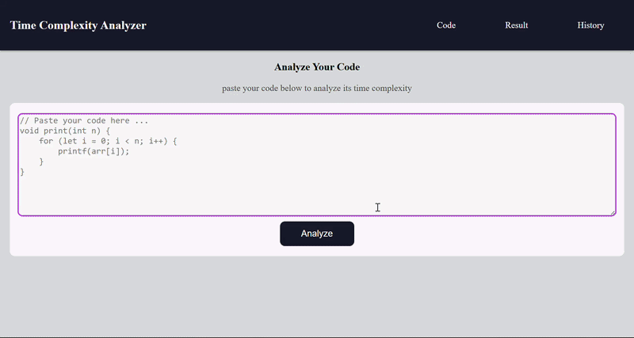

# Time Complexity Analyzer

## About

I built a real compiler pipeline from scratch — not using existing parsing libraries, but implementing every layer myself: a hand-written lexer that tokenizes code character by character, a recursive descent parser that builds an actual Abstract Syntax Tree (AST), and a tree-walking complexity analyzer that determines Big O notation. The goal was to understand how compilers actually work instead of treating parsing as a black box. This is a full-stack project: Spring Boot REST API on the backend, MySQL database for persistence, and a React/vanilla JS frontend deployed live.

**Live demo:** [https://time-complexity-analyzer-kaos.onrender.com](https://time-complexity-analyzer-kaos.onrender.com)

---

## Demonstration



---

## What It Does

Paste Java code into the web UI. The system:
1. **Lexes** the raw source into tokens (handles comments, two-char operators, escape sequences)
2. **Parses** the token stream with recursive descent, building an AST of `ForNode`, `WhileNode`, and `BlockNode` objects
3. **Walks** the AST to calculate maximum loop nesting depth and detect logarithmic loop patterns
4. **Classifies** the time complexity: O(1), O(n), O(n²), O(n³), O(log n), O(n log n)
5. **Stores** every submission in MySQL with timestamps
6. **Returns** results instantly with full submission history

Handles edge cases correctly: consecutive loops are O(n), not O(n²); nested loops are O(n²); detects when `/=` or `*=` is applied to the loop variable for log n detection.

---

## Why This Project

Most developers use parsing libraries without understanding them. I wanted to know: how does a compiler actually read and understand code? This project forced me to implement:
- Lexical analysis — turning raw text into meaningful tokens
- Parsing — building structure from tokens
- Tree traversal — extracting information from the structure

Result: I now understand the first three phases of compilation at a deep level, not just theoretically.

---

## Tech Stack

| Layer | Technology | Why |
|---|---|---|
| **Backend** | Spring Boot | REST API, dependency injection, clean architecture |
| **Database** | MySQL + Spring Data JPA | Persistent storage, ORM for clean queries |
| **Frontend** | HTML/CSS/vanilla JS | Keep it simple, understand the fundamentals |
| **Compiler** | Hand-written Java | No libraries — understand every line |
| **Hosting** | Render (backend) + filess.io (MySQL) | Free tier, good enough for portfolio |
| **Build** | Maven + Docker | Standard Java build tool, containerized for deployment |

---

## Architecture

```
User pastes code
        ↓
    Lexer.java
    ├─ Strips comments (// and /* */)
    ├─ Scans character by character
    ├─ Recognizes keywords (for, while, if)
    ├─ Handles two-char operators (+=, /=, <<, >>)
    └─ Outputs: List<Token>
        ↓
    Parser.java (Recursive Descent)
    ├─ parseBlock() → parseFor() / parseWhile() → parseBlock() (recursive)
    ├─ Builds real AST: ForNode, WhileNode, BlockNode
    ├─ Stores loop variable and detects log n patterns
    └─ Outputs: rootNode (AST)
        ↓
    Parser.walk()
    ├─ Traverses the AST
    ├─ Tracks currDepth and maxDepth
    ├─ depth++ entering loop, depth-- exiting
    └─ Outputs: maxDepth
        ↓
    ComplexityAnalyzer.java
    ├─ Reads maxDepth and log n flags
    ├─ Maps depth → O(n^depth)
    └─ Outputs: ComplexityResult
        ↓
    Spring Boot REST API
    ├─ /api/analyze (POST) → analyze code, save to DB, return result
    ├─ /api/submissions (GET) → return all past submissions
    └─ MySQL persists everything
        ↓
    Frontend
    ├─ index.html (paste code, hit analyze)
    └─ history.html (see all submissions)
```

**Key design decision:** The lexer, parser, and analyzer are completely decoupled. Parser doesn't know about Spring. Analyzer doesn't know about the REST layer. Each layer has one job.

---

## Key Features

✅ **Real lexer** — not regex hacks. Character-by-character scanning with proper tokenization.

✅ **Recursive descent parser** — builds an actual AST, not just counting braces. Handles nested structures correctly.

✅ **Variable-aware log n detection** — checks if `/=` is applied to the loop variable specifically, not just any `/=` in the loop.

✅ **Consecutive vs nested loops** — correctly identifies `for(){} for(){}` as O(n), not O(n²).

✅ **Persistent history** — every analysis is saved to MySQL, searchable by submission ID.

✅ **Live deployment** — not just localhost. Actually deployed and accessible to anyone.

---

## Current Limitations (Honest Assessment)

**Log n detection is still token-based.** If you write `x *= 2` anywhere in a loop body, it flags as log n even if `x` isn't the loop variable. Variable detection helps but still has false positives.

**No recursion detection.** `fib(n) { return fib(n-1) + fib(n-2); }` shows as O(1). Recursion requires method declaration tracking and call graph analysis — planned for v2.

**Java only.** Multi-language support requires language-specific lexers/parsers for each — not worth it until the core is perfect.

---

## API Endpoints

| Method | Endpoint | Request | Response |
|---|---|---|---|
| POST | `/api/analyze` | `{"code": "..."}` | `{"complexity": "O(n²)", "depth": 2}` |
| GET | `/api/submissions` | — | `[{id, code, complexity, depth, createdAt}, ...]` |

---

## Running Locally

### Prerequisites
- Java 25 (or 21 LTS)
- Maven
- MySQL Server
- Git

### Setup

```bash
# 1. Clone
git clone https://github.com/ks9205124-cloud/time-complexity-analyzer.git
cd time-complexity-analyzer

# 2. Create database
mysql -u root -p
CREATE DATABASE tca_db;
EXIT;

# 3. Configure credentials
cp src/main/resources/application.properties.example src/main/resources/application.properties
# Edit application.properties with your MySQL password

# 4. Run
./mvnw spring-boot:run

# 5. Open
http://localhost:8080/index.html

# 6. Test API
curl -X POST http://localhost:8080/api/analyze \
  -H "Content-Type: application/json" \
  -d '{"code":"for(int i=0;i<n;i++){for(int j=0;j<n;j++){}}"}'
```

Expected output: `{"complexity":"O(n^2)","depth":2}`

---

## Example Inputs & Outputs

### O(n²) — Nested Loops
```java
for(int i = 0; i < n; i++) {
        for(int j = 0; j < n; j++) {
sum = sum + 1;
        }
        }
```
**Output:** `O(n²)`, depth 2 ✅

### O(n) — Consecutive Loops (Not O(n²))
```java
for(int i = 0; i < n; i++) { }
        for(int j = 0; j < n; j++) { }
```
**Output:** `O(n)`, depth 1 ✅ (this trips up naive implementations)

### O(log n) — Dividing Loop
```java
for(int i = 1; i < n; i *= 2) { }
```
**Output:** `O(log n)`, variable `i` detected, log n operator on `i` ✅

### O(n log n) — Outer Linear, Inner Log
```java
for(int i = 0; i < n; i++) {
        for(int j = 1; j < n; j *= 2) { }
        }
```
**Output:** `O(n log n)` ✅

### O(1) — No Loops
```java
int x = 5;
int y = x + 10;
```
**Output:** `O(1)`, depth 0 ✅

---

## Project Structure

```
time-complexity-analyzer/
├── src/main/java/com/shaurya/spring/timecomplexityanalyzer/
│   ├── engine/
│   │   ├── Lexer.java           (tokenizes source)
│   │   ├── Token.java           (token data class)
│   │   ├── TokenType.java       (enum of all token types)
│   │   ├── Parser.java          (recursive descent → AST)
│   │   ├── ComplexityAnalyzer.java (walks AST → Big O)
│   │   └── nodes/
│   │       ├── rootNode.java    (interface)
│   │       ├── ForNode.java     (AST node)
│   │       ├── WhileNode.java   (AST node)
│   │       └── BlockNode.java   (AST node)
│   ├── controller/
│   │   └── AnalysisController.java (REST endpoints)
│   ├── service/
│   │   └── AnalysisService.java (business logic)
│   ├── repository/
│   │   └── SubmissionRepository.java (JPA interface)
│   ├── model/
│   │   └── Submission.java (database entity)
│   └── dto/
│       ├── AnalysisRequest.java (incoming JSON)
│       └── ComplexityResult.java (outgoing JSON)
├── src/main/resources/
│   ├── static/
│   │   ├── index.html
│   │   ├── history.html
│   │   ├── styles.css
│   │   └── script.js
│   └── application.properties.example
├── Dockerfile (for Render deployment)
├── pom.xml (Maven dependencies)
└── README.md (this file)
```

---

## Lessons Learned

**1. Lexing is harder than it looks.** Handling comments, two-character operators, escape sequences correctly requires careful state management. One off-by-one error and everything breaks.

**2. Recursive descent is elegant.** Each parse method mirrors the grammar directly. `parseBlock()` calls `parseFor()` which calls `parseBlock()` — the recursion naturally represents nesting.

**3. Proper AST beats hacks.** My first attempt was stack-based brace counting. It worked for simple cases but broke on consecutive loops. A real tree fixes everything.

**4. Deployment is half the work.** Getting the jar to build, Docker to work, MySQL credentials to not leak on GitHub, frontend fetch URLs to point to the right place — these took as long as the algorithm itself.

**5. Test edge cases early.** Consecutive loops, empty input, deeply nested structures — these expose design flaws fast.

---

## What's Next (v2)

- **Precise log n detection** — track loop variable names through the condition and body, only flag `/=` or `*=` when applied to that variable
- **Recursion detection** — parse method declarations, track recursive calls, detect O(2ⁿ) patterns
- **Multi-language support** — hand-written lexers/parsers for C, JavaScript, Python (Python indentation is the tricky part)
- **Better error handling** — report line numbers and error messages for malformed code
- **Optimization detection** — identify memoization, tail recursion, etc.

---

## Status

✅ **Shipped and live** at [time-complexity-analyzer-kaos.onrender.com](https://time-complexity-analyzer-kaos.onrender.com)

Full compiler pipeline working: hand-written lexer → recursive descent parser → AST → tree walker → Big O classification.

Detects O(1), O(n), O(n²), O(n³), O(log n), O(n log n) for `for` and `while` loops correctly, including edge cases like consecutive loops.

**Next:** v2 with recursion detection after learning compiler theory in CS coursework.

---

## Contact & Attribution

Built by Shaurya as a portfolio project demonstrating compiler design principles.

GitHub: [ks9205124-cloud](https://github.com/ks9205124-cloud)